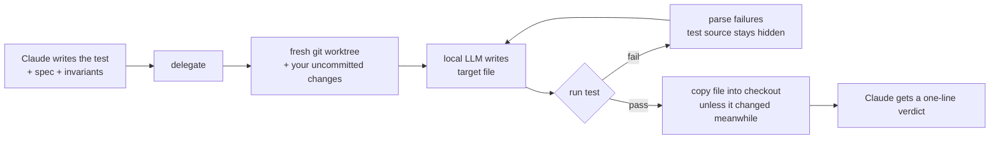

<div align="center">

# local-llm-worker

**Let Claude hand the bulk reading to your local LLM: test logs, big files, web pages. Claude only gets the answer.**

[](https://github.com/JoblessJoe/local-llm-worker/actions/workflows/test.yml)
[](LICENSE)
[](package.json)
[](package.json)
[](#install)
[](#use-it-in-any-mcp-client)
[](https://joblessjoe.com/local-llm-worker)

Works with Ollama · llama.cpp · LM Studio · vLLM · LocalAI · any OpenAI-compatible endpoint

</div>

---

Reading a 5,000-line test log or three docs pages costs the same frontier-model tokens as hard
architectural work. **local-llm-worker** is an MCP server and Claude Code plugin that moves
that bulk work onto the GPU (or CPU) you already own:

- **`offload`**: your local model runs the noisy command or reads the big file. Claude gets
  the answer.
- **`research`**: your local model searches the web, reads the pages in full and returns a
  cited answer. Claude never sees the pages.
- **`delegate`** *(opt-in)*: your local model writes one file in an isolated git worktree
  and retries until **a test Claude wrote first** passes. Claude gets a one-line verdict, not
  the code.

```text
> offload  npm test 2>&1   "Which test fails, and why?"
`fixed coupon never goes below zero` (test/cart.test.js:404): applyCoupon(5, {type:'fixed',
value:10}) returns -5, expected 0.
— qwen3-coder:30b-a3b-q4_K_M · 19,132 input tokens read locally
```

## Why

| | Claude does it | Claude delegates it |
|---|---|---|
| Find one failure in a 50 KB test log | ~19,000 tokens of log in context | a ~130-token answer |
| Answer from three docs pages | the pages, or a summary of them | a cited paragraph + source list, from the full pages |
| Write a helper that tests can pin down | output tokens for the code, then re-reading it | writes the test, reads `PASS` |
| Several independent helpers | sequential edits | parallel delegates, each in its own worktree |

- **Any model, any hardware.** No hardcoded models, no GPU assumptions. CPU-only works, just
  slower.
- **Parallel by default.** Several calls in one turn, or from several subagents, run at once.
  The concurrency limit is a config value, not a hardcoded lock.
- **Fits the context automatically.** Material is sized to the model's context window per
  text (number-heavy logs need more tokens than prose). Anything cut is reported.
- **Zero dependencies.** Plain Node ≥ 18. Installing from git needs no `npm install`.
- **Agent-configurable.** One `configure` call shows the config, the backend and its models,
  and changes any setting. It takes effect on the next call, with no restart.

## Install

**Prerequisites:** Node ≥ 18, git, and a running local model server (e.g.
`ollama pull qwen3-coder:30b`).

### Claude Code plugin

```text
/plugin marketplace add JoblessJoe/local-llm-worker
/plugin install local-llm-worker@local-llm-worker
```

Then just ask: *"set up local-llm-worker for my machine"*. Claude finds your backend, picks a
model, and asks which tools it should use on its own (`auto_use`). By default that's `offload`
and `research`; `delegate` is opt-in. Every tool also works whenever you ask for it.

### Make Claude use it every time

A session-start reminder nudges Claude toward the tools you chose. For dependable use, add
this to your `CLAUDE.md`; setup offers to do it for you:

```markdown
## Local LLM (local-llm-worker)
- Run test suites, builds and other noisy commands through `offload` (`command`), and read logs or files over ~300 lines through it, instead of reading the output yourself.
- Use `research` for web lookups instead of WebSearch/WebFetch.
```

With this in place, Claude ran a noisy failing test suite through `offload` every time we
tried. That session cost 40 % less than one that read the output itself.

### Use it in any MCP client

Claude Desktop, Cursor, Windsurf, and others:

```json
{
  "mcpServers": {
    "local-llm-worker": {
      "command": "node",
      "args": ["/path/to/local-llm-worker/src/index.js"],
      "env": { "LLW_MODEL": "qwen3-coder:30b" }
    }
  }
}
```

Claude Code without the plugin:
`claude mcp add local-llm-worker -- node /path/to/local-llm-worker/src/index.js`

## How `delegate` works



- **Isolated.** Each call gets its own `git worktree` with your uncommitted changes mirrored in,
  plus symlinked `node_modules` / `.venv`, so parallel calls never collide.
- **Locked scope.** Exactly one target file, jailed to the repo, and never one of the
  `test_files` you name.
- **Useful feedback.** Retries get the parsed failing assertions (TAP, pytest, jest, vitest,
  go, cargo), not a stack-trace tail.
- **Safe apply.** If you or another delegate touched the target meanwhile, nothing is
  overwritten.
- **Honest failure.** After N attempts you get the last failure and the kept worktree. Transport
  errors are reported as errors, never as a model FAIL.
- **Self-cleaning.** Each delegate prunes `llw-*` worktrees left behind by a crashed server, and
  kept ones older than 24 h. Untracked files over 10 MB are not copied into the worktree (the
  verdict says how many were skipped).

The bundled [skill](skills/local-llm-worker/SKILL.md) teaches Claude how to write specs that
pass: one invariant per test, exact API surface in `context`, properties instead of examples, and
never delegating auth or money code.

## Results

On one 24 GB GPU (Tesla P40) with `qwen3-coder:30b-a3b-q4_K_M` on Ollama:

| Task | Read locally | Claude received |
|---|---|---|
| `offload`: find the failing test in a 50 KB test log | ~19,100 tokens | ~130 tokens |
| `offload`: find one ERROR line in a 90 KB log | ~30,400 tokens | the line, quoted |
| `research`: "Latest Node.js LTS and its end of life?" (3 pages) | 7,025 tokens | a cited answer, ~250 tokens |

Several calls run in parallel: three in one turn took as long as the slowest one.

### Which model?

From a reproducible benchmark ([`bench/`](bench/)) of 120 `delegate` runs across six task
types:

| Model | Good for | Speed per call |
|---|---|---|
| `qwen3-coder:30b-a3b` | the best default: parsers, pure functions, Python | 15–55 s |
| `devstral-small-2:24b` | edits to existing files, parsers | 2–9 min |
| `granite4.1:8b` | small, well-specified functions on modest hardware | 25–90 s |

Retries matter: with failure feedback, qwen3-coder's pass rate rose by half from the first
attempt to the third. `offload` and `research` work well with any of these. Every run is logged
(see [Stats](#stats)), so you can measure your own setup.

## Configuration

Agents should use `configure`. Humans can edit JSON. Layers (later wins):

1. built-in defaults
2. user: `~/.config/local-llm-worker/config.json` (respects `$XDG_CONFIG_HOME`)
3. project: `<git root>/.local-llm-worker.json`
4. env: `LLW_<KEY>`, e.g. `LLW_BASE_URL`, `LLW_MODEL`. Integers are digits only, booleans
   `true`/`false`/`1`/`0`/`yes`/`no`, `link_dirs` a comma list or JSON array, `headers` a JSON
   object. An invalid value is ignored and `configure` lists it under `warnings`.

A config file with invalid JSON is an error that names the file.

| Key | Default | Meaning |
|---|---|---|
| `base_url` | `http://localhost:11434` | Backend root. A trailing `/v1` is stripped. |
| `api` | `auto` | `auto` · `ollama` · `openai`. Auto probes `/api/version`. |
| `api_key` | `""` | Sent as `Authorization: Bearer`. Shown as `(set)`, never printed. Plugin users can set it under the plugin's settings instead, which keeps it in the OS keychain. |
| `headers` | `{}` | Extra HTTP headers for a gateway, e.g. `{"X-Api-Key": "..."}`. Values shown as `(set)`. |
| `model` | `""` | Default model for both tools. |
| `offload_model` | `""` | Override for `offload` (e.g. long-context). |
| `delegate_model` | `""` | Override for `delegate` (e.g. a coder). |
| `research_model` | `""` | Override for `research` (e.g. long-context). |
| `search_url` | `""` | SearXNG instance for `research` (JSON output enabled). |
| `research_sources` | `3` | Pages `research` reads per search (max 10). |
| `page_timeout_ms` | `30000` | Per page download and per search. |
| `allow_private_urls` | `false` | Let `research` read pages on loopback, link-local or private addresses (the `search_url` itself is always allowed). |
| `num_ctx` | `32768` | Context window (Ollama). |
| `max_tokens` | `8192` | Output limit per answer, sent on both APIs (`num_predict` on Ollama). A cut-off answer is reported, not tested. |
| `keep_alive` | `""` | Ollama only: how long the model stays loaded, e.g. `"30m"` or `-1` (forever). `""` keeps the server default (5 min). |
| `concurrency` | `4` | Max in-flight LLM requests per server process. |
| `timeout_ms` | `600000` | Per LLM request, counted from slot acquisition. |
| `test_timeout_ms` | `600000` | Per test / command run. |
| `max_attempts` | `3` | Delegate rounds (cap 10). |
| `link_dirs` | `node_modules, .venv, venv, vendor` | Symlinked into each worktree. |
| `log_path` | `~/.local-llm-worker/runs.jsonl` | Run log; `""` disables. |
| `auto_use` | `offload, research` | Tools Claude uses on its own, via a short session-start reminder. `delegate` is opt-in. Every tool still works when you ask for it; `[]` turns the reminder off. |

```jsonc
// configure — no args: effective config, value sources, backend, model list
// configure — change settings (null removes a key):
{ "set": { "model": "qwen3-coder:30b", "num_ctx": 65536 }, "scope": "user" }
```

With no model set, it uses the backend's only model, or fails with the list. It never guesses,
because the guess could be an embedding model.

### Backends

| Backend | `base_url` | API |
|---|---|---|
| Ollama | `http://localhost:11434` | native `/api/chat`. Its OpenAI endpoint ignores `num_ctx` and silently truncates long prompts. |
| llama.cpp `llama-server` | `http://localhost:8080` | `/v1/chat/completions` |
| LM Studio | `http://localhost:1234` | `/v1/chat/completions` |
| vLLM | `http://localhost:8000` | `/v1/chat/completions` |
| LocalAI, others | your endpoint | `/v1/chat/completions` |

Verified end-to-end on Ollama (GPU) and llama.cpp `llama-server` (CPU only). `<think>` blocks
from reasoning models are stripped. If a backend reads less of the prompt than was sent, the
result says so.

## Tool reference

<details>
<summary><code>offload</code>: read locally, answer briefly</summary>

| Arg | |
|---|---|
| `task` | **required.** The question. |
| `files` | Paths relative to the git root; must stay inside it. |
| `command` | Shell command whose stdout + stderr is the material, e.g. `npm test 2>&1`. |
| `model` | Override. |

Material that doesn't fit next to the answer is cut in the middle (head and tail kept, sized per
text), and the cut is reported.
</details>

<details>
<summary><code>research</code>: search and read the web locally, answer with citations</summary>

| Arg | |
|---|---|
| `question` | **required.** The research question. |
| `query` | Search query, if it should differ from the question. |
| `urls` | Read these pages instead of searching (no `search_url` needed). |
| `max_sources` | Pages to read when searching (1–10). |
| `model` | Override. |

Page URLs that resolve to loopback, link-local or private addresses are refused, on every
redirect hop too, unless `allow_private_urls` is `true`. Fetches pages in parallel and walks further down the results when a page fails (404, PDF,
JavaScript-only). Each page is reduced to readable text, with `<main>`/`<article>` preferred and
nav, footer and scripts dropped, then the pages share the `num_ctx` budget. Searching needs a
[SearXNG](https://github.com/searxng/searxng) instance:
`docker run -d -p 8888:8080 searxng/searxng`, add `json` under `search.formats` in its
`settings.yml`, then set `search_url` to `http://localhost:8888`.
</details>

<details>
<summary><code>delegate</code>: write one file until the test passes</summary>

| Arg | |
|---|---|
| `spec` | **required.** What the file must do. |
| `target_file` | **required.** The one file to create or modify. |
| `test_command` | **required.** Run in the worktree by the platform shell (`sh -c`, or `cmd.exe /d /s /c` on Windows); exit 0 = pass. On timeout the whole process tree is killed. |
| `properties` | Invariants, one per gating test. |
| `context` | The exact API surface the file may use. |
| `test_files` | The target may not be one of these. |
| `max_attempts`, `model` | Overrides. |
| `show_code` | Also return the code (default `false`, which is where the saving comes from). |
| `apply` | Copy a passing file into the checkout (default `true`). |
</details>

<details>
<summary><code>configure</code>: inspect and change settings</summary>

No args returns the report. `{ "set": {...}, "scope": "user" | "project" }` validates and writes.
Unknown keys are rejected with the list of valid ones.
</details>

## Stats

Every run appends one line to `log_path`:

```json
{"ts":"2026-10-04T17:51:28.476Z","tool":"delegate","model":"qwen3-coder:30b-a3b-q4_K_M","api":"ollama","ok":true,"attempts":1,"in_tok":201,"out_tok":195,"ms":57909}
```

```sh
jq -s 'group_by(.tool) | map({tool: .[0].tool, runs: length, ok: (map(select(.ok)) | length), out_tok: (map(.out_tok) | add)})' ~/.local-llm-worker/runs.jsonl
```

## FAQ

**Does Claude ever see the generated code?**
Only if it asks (`show_code: true`) or reads the file. Review before merging anything that
matters. A passing test is a gate, not a code review.

**What should I not delegate?**
Auth, money, permissions, security, and anything whose spec has no single right answer. The
skill tells Claude this too.

**Can the local model cheat the test?**
It never sees the test source. It can write only the one target file, and that file can't be
one of the `test_files` you list.

**A long `delegate` or `research` call was cut off.**
The server sends MCP progress notifications every 15 s when the client asks for them
(`progressToken`), but whether that helps depends on the client:

| Client | Tool-call limit | Knob |
|---|---|---|
| Claude Code | No practical wall-clock limit by default (~28 h); a stdio call is aborted after 30 min with no response *and no progress*, which the heartbeat prevents | `MCP_TOOL_TIMEOUT` (ms, hard limit, progress does not extend it), `CLAUDE_CODE_MCP_TOOL_IDLE_TIMEOUT` (ms, `0` disables), or `"timeout"` in `.mcp.json` |
| Claude Desktop | ~60 s for local servers; progress does not reset it | none known: run long jobs from Claude Code, or lower `max_attempts` and `research_sources` |
| Cursor | ~60 s; progress reportedly does not reset it | none known |

**Does it send my code anywhere?**
Only to the `base_url` you configure, which is `localhost` by default. `research` sends your
search query to your own SearXNG and downloads public pages. It never sends your files.

## Development

```sh
npm test   # 88 tests, fake backend + fake web, no LLM or network needed
```

`src/index.js` is the stdio JSON-RPC server. `src/worker.js` holds the config, backend client,
tools and failure extractor.

Releases are automatic: every push to `main` runs the tests, bumps the patch version everywhere
it appears (`npm run bump` does the same locally; pass `minor`, `major` or `x.y.z` for more),
tags it and creates a GitHub Release.

## Roadmap

- more search backends (Brave, Tavily) alongside SearXNG
- multi-file delegates
- per-task model routing
- an async job API for clients with a 60 s tool limit (Claude Desktop, Cursor)

## License

[MIT](LICENSE) © Johannes Tebbert

The JoblessJoe logo (`.claude-plugin/icon.png`) is not covered by this license. All rights reserved.
